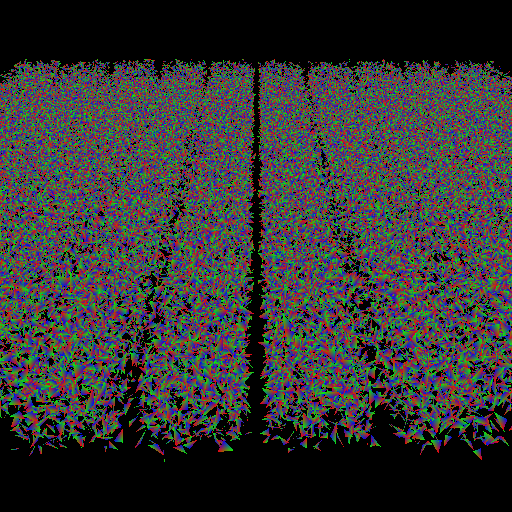

# Notes

Useful command to convert .jpg to .png

```bash
find . -name "*.jpg" -exec mogrify -format png {} \;
```

Create and compare bench baselines, see [critcmp](https://github.com/BurntSushi/critcmp)

```bash
cargo bench -- -save-baseline before 
cargo bench -- -save-baseline change
critcmp before change
```

Results from first night benchmarking without parallelism, started at "main"

```bash
bvh_intersection/random_100k_tri_512x512
----------------------------------------
new             1.00     199.7±1.17ms       ? ?/sec
tile            1.00     199.7±1.17ms       ? ?/sec
current         1.08     214.8±1.45ms       ? ?/sec
base            1.08     216.0±2.53ms       ? ?/sec
lib             1.08     216.1±1.91ms       ? ?/sec
epsilon_f32     1.08     216.6±3.09ms       ? ?/sec
epsilon         1.09     216.7±2.69ms       ? ?/sec
main_range      1.09     217.5±4.16ms       ? ?/sec
early_out       1.15     228.7±4.10ms       ? ?/sec
inline2         1.22     243.6±3.87ms       ? ?/sec
aabb            1.22     244.4±2.16ms       ? ?/sec
old_epsilon     1.23     245.7±3.21ms       ? ?/sec
inline          1.23     246.1±3.99ms       ? ?/sec
no_entity       1.25     249.5±2.04ms       ? ?/sec
branchless      1.25     249.9±9.74ms       ? ?/sec
clippy          1.26     250.9±4.01ms       ? ?/sec
vec3A           1.29     258.3±4.34ms       ? ?/sec
ray             1.30     259.5±5.42ms       ? ?/sec
save-img        1.30     259.8±2.01ms       ? ?/sec
unchecked       1.31     260.8±1.96ms       ? ?/sec
main            1.31    262.4±26.79ms       ? ?/sec
ray64           1.33     264.9±3.20ms       ? ?/sec
```


> I love rust and the tooling
